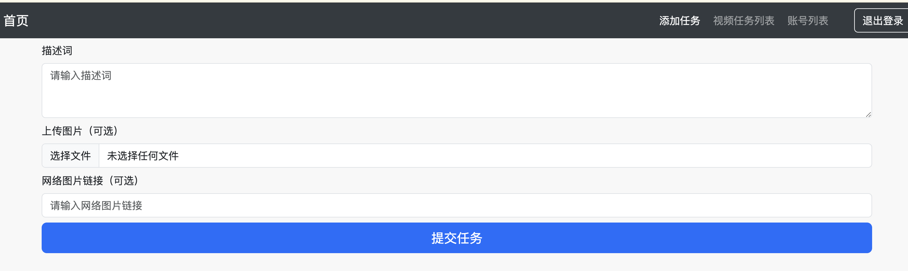
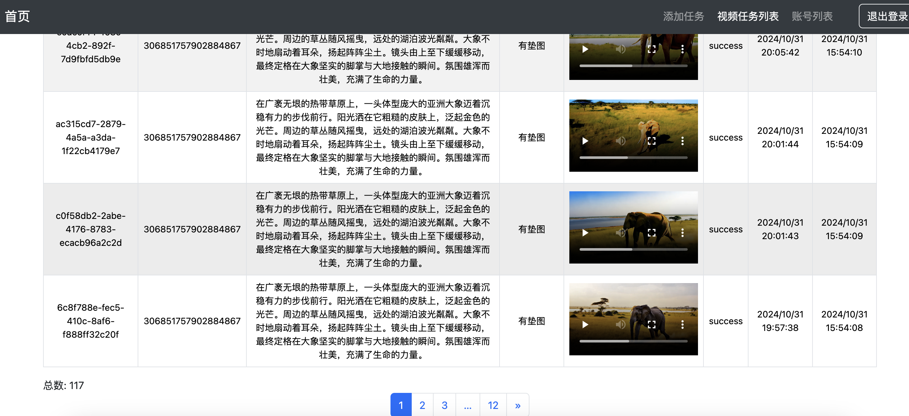
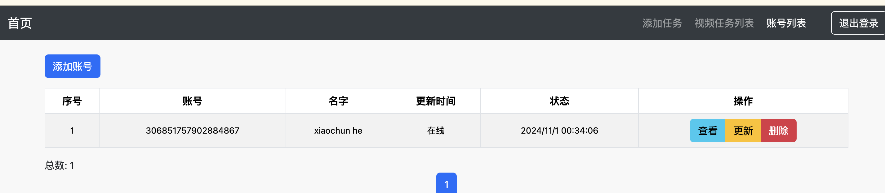
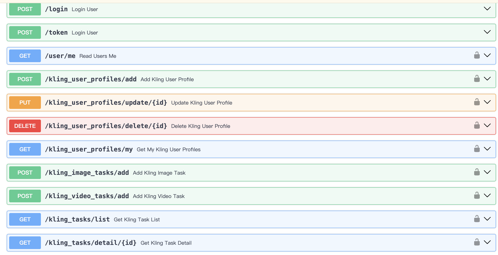

# Conch Video Generation API Proxy

## Project Overview

This project is a conch video generation API proxy, designed to provide the following features:

- **Automatic Queueing**: Intelligently manage task queues to ensure tasks are executed in order.
- **Multi-account Management**: Support unified management of multiple accounts, making it easy for users to switch and operate.
- **Task Management**: Provide functions for task creation, monitoring, and management.
- **Automatic Task Submission**: Automate the task submission process to reduce manual intervention.
- **Kling Account Hosting**: Support for managing Kling accounts, including task creation and management.

Additionally, this project supports interface integration, making it easy to integrate with other systems.

## Usage Instructions

Currently, this service is open for free use. You can experience it directly through the following URL:

[http://hailuo.st-ai.top/public](http://hailuo.st-ai.top/public)

No registration or login is required, and you can use all features directly.

### API Documentation

For detailed API documentation, please visit:

- [API Documentation (English)](http://hailuo.st-ai.top/docs)

## Contact Information

If you have any questions or suggestions, please contact us through the following ways:

Thank you for your use and support!

# 海螺视频生成API代理

## 项目简介

这个项目是一个海螺视频生成的API代理，旨在提供以下功能：

- **自动排队**：智能管理任务队列，确保任务按顺序执行。
- **多账号管理**：支持多个账号的统一管理，方便用户切换和操作。
- **任务管理**：提供任务的创建、监控和管理功能。
- **自动任务提交**：自动化任务提交流程，减少人工干预。
- **可灵账号托管**：支持可灵账号的管理，包括任务创建和管理。

此外，该项目还支持接口对接，方便与其他系统集成。

## 使用说明

目前，该服务免费开放使用。您可以通过以下网址直接体验：

[http://hailuo.st-ai.top/public](http://hailuo.st-ai.top/public)

无需注册或登录，直接访问即可使用所有功能。

### API 文档

有关详细的 API 文档，请访问：

- [API 文档（中文）](http://hailuo.st-ai.top/docs)

## 联系方式

如有任何问题或建议，请通过以下方式联系我们：

感谢您的使用与支持！

